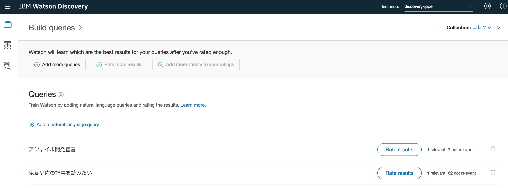

# Discovery Hack

## 準備

### サービスを作成する

* Discovery サービスインスタンス

    ```
    $ npm run service
    ```

    - サービスと Watson Discovery News (English) が作成される。

* Object Storage

    ```
    $ bx service create cloud-object-storage Premium cos-ippei
    ```

    - これだと、IBM Cloud Console 上 `cos-ippei` という名前にならない。UUID？ サポートに問合せ中
    - とりあえず Console から買うことにする。

## Environments
* Done
    - list
    - list detail (id指定、ステータスが付加)
    - create
    - update (サンプルコード無し、name, description の変更)
    - delete
* Pending
    - list field (Node information not currently available.)

## Configurations
Node.js ではあまり操作できなそう。createEnvironment で自動生成されるので気にする必要ない？
* Done
    - list
* Pending
    - add (Node method not currently available.)
    - Element Classification Enrichments (サンプルコード無し)
    - update (サンプルコード無し, 実行すると null が返されるが params の値に更新されない？)
    - delete (ode method not currently available.)

## Collections
* Done
    - create (params collection_name は誤植、name が正解っぽい。。。)
    - list
    - list detail
    - delete
* Pending
    - List collection fields (Node information not currently available.)
    - update (Node method not currently available)

## Documents
* Done
    - add (.html, .pdf, .docx, を追加, .txt はエラーなのはOK、agile.json はエラー Why？ ja は not supported??)
        - file_content_type = 'application/json' を設定すると追加できた。(以前はAPIリファレンスに記述されてなかった。)
    - delete (document_id 指定で消す、但し、id を list する方法が無い)
    - get (getDocumentStatus、文書IDで引くが全情報取得できない。全情報を取得したい場合は query = DQL で `id:"8bcbe934-dcf3-4331-9ffc-5ddc050c882e"` などとする。。。)
* Pending
    - update (Node method not currently available.)
    - list (じゃなくて実体はget a doc, しかも Node method not currently available.)

## Queries
* Done
    - Query your collection
* Pending
    - Query ingestion notices (メソッド queryNotices はあるっぽいが、Example request not currently available.)
    - Multiple collection querying (メソッド無いっぽいのに Example request not currently available. RESTだと対象の collection_id を渡しているので、query の複数発行で吸収可能 )
    - Notices across multiple collections (メソッド無いっぽいのに、Example request not currently available. 前述 queryNotices の複数発行で九州可能か？)
    - Knowledge Graph Entity Queries (メソッド queryEntities はあるっぽいが、Example request not currently available.)
    - Knowledge Graph Relationship Queries (メソッド queryRelations はあるっぽいが、Example request not currently available.)

## Training data
* Done
    - list (Tool で自然言語に対してRelevant 適切10, 不適切0 を設定)

        > 最低49クエリーに対して設定するなんて大変すぎる。
        > Tool は relevance は 10 or 0 だが、number なので降順のように並べることも可能だろう。




## 感想
* 文書IDの一覧を取得できないので、管理UI的な物を作る場合は DB 的なものが必要。
* 使い倒そうとすると、フィールドやらエンリッチやら情報を付加、クエリーを組み立てる必要がありそう。Automatic にならない。
* REST (Curl) の API に比べ Java, Node.js, Python は未対応が多い。が、Node.js の watson-developer-cloud で取込むだろうから、request や axios などで自前のアクセッサを開発するのは非効率。


## Cloud Object Storage を試す。
* bx コマンドのインスタンスとエイリアスの問題は問合せ中だが。。。
* とりあえず、mac にマウントしてみるか。
    - https://qiita.com/wokamoto/items/e62034d8bb1c81dcdd78
    - https://qiita.com/satorubz/items/eba9bf9909b158a5d73c
* COS の Console からサービス資格情報を作成する。
    - 作成時にオプションが必要。{"HMAC":true}
        - https://qiita.com/osonoi/items/81f52f57ded3e8aac82d

```
{
  "apikey": "FlMYX1Iv_WBWuaMEYy0c6vAF2-xWhwzQqJSauRCEZxZp",
  "cos_hmac_keys": {
    "access_key_id": "b9f922aa86d94535b8763dfe0338e0c0",
    "secret_access_key": "b8d2cc844ab56fab42085084b6766ad348f31e6764024b59"
  },
  "endpoints": "https://cos-service.bluemix.net/endpoints",
  "iam_apikey_description": "Auto generated apikey during resource-key operation for Instance - crn:v1:bluemix:public:cloud-object-storage:global:a/48984e66e3b9b429a0cfe14d0637f075:acd65abd-9f08-4dfd-af91-7eec66dd28c3::",
  "iam_apikey_name": "auto-generated-apikey-b9f922aa-86d9-4535-b876-3dfe0338e0c0",
  "iam_role_crn": "crn:v1:bluemix:public:iam::::serviceRole:Writer",
  "iam_serviceid_crn": "crn:v1:bluemix:public:iam-identity::a/48984e66e3b9b429a0cfe14d0637f075::serviceid:ServiceId-bd76bec5-9ae5-4f0d-83a3-f98e78965b29",
  "resource_instance_id": "crn:v1:bluemix:public:cloud-object-storage:global:a/48984e66e3b9b429a0cfe14d0637f075:acd65abd-9f08-4dfd-af91-7eec66dd28c3::"
}
```

```
$ brew install awscli
$ aws configure
AWS Access Key ID [None]: b9f922aa86d94535b8763dfe0338e0c0
AWS Secret Access Key [None]: b8d2cc844ab56fab42085084b6766ad348f31e6764024b59
Default region name [None]: us-geo
Default output format [None]: json
```

```
$ aws s3 ls --endpoint=https://s3-api.us-geo.objectstorage.softlayer.net
2018-05-10 11:34:55 docs-ippei
```

```
$ brew install goofys
```

* IBM Cloud Console で、bucket「docs-ippei」(us-geo, Standard)を作成して、適用なファイルを保管する。


goofys --endpoint=https://s3-api.us-geo.objectstorage.softlayer.net docs-ippei /docs-ippei

goofys --endpoint=https://s3-api.us-geo.objectstorage.service.networklayer.com my-bucket /ext/icos